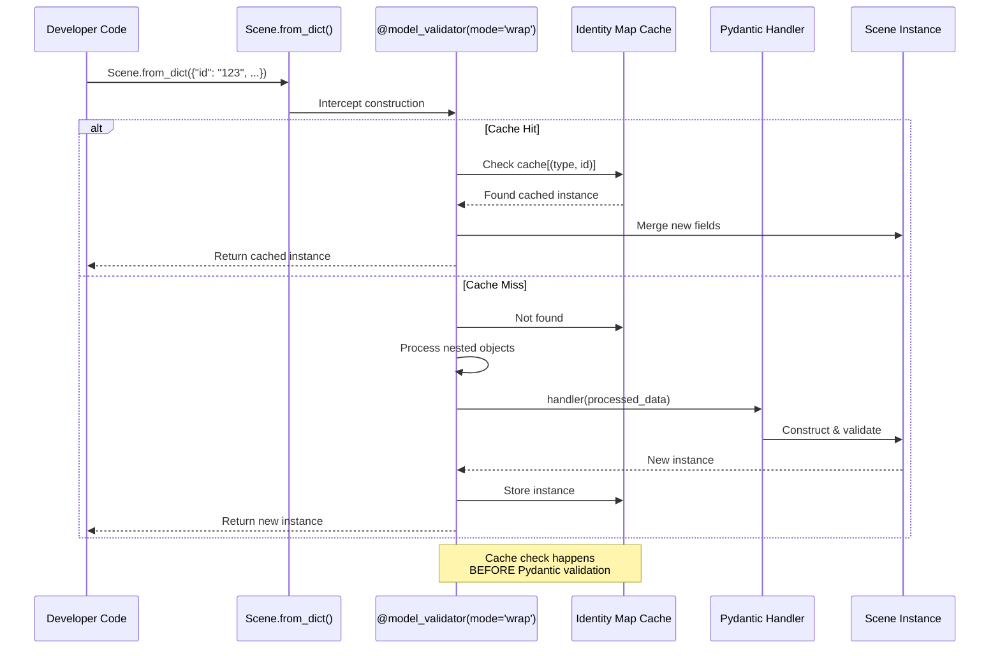

# Identity Map Architecture

## What is an Identity Map?

An identity map is a design pattern that ensures only one instance of any given object exists in memory at a time. When you query for the same entity multiple times, you get the same Python object reference rather than different instances with the same ID.

**Without identity map:**

```python
# Two separate queries return different objects
scene1 = await client.find_scene("123")
scene2 = await client.find_scene("123")
assert scene1 is not scene2  # True - different objects!

# Updating one doesn't affect the other
scene1.title = "Updated"
print(scene2.title)  # Still the old title - stale data!
```

**With identity map:**

```python
# Two queries return the SAME object reference
scene1 = await client.find_scene("123")
scene2 = await client.find_scene("123")
assert scene1 is scene2  # True - same object!

# Updating one affects all references
scene1.title = "Updated"
print(scene2.title)  # "Updated" - same object!
```

## Benefits

1. **No stale data** - All references to an entity stay synchronized
2. **Memory efficiency** - One object in memory instead of many duplicates
3. **Relationship consistency** - Related entities always point to cached instances
4. **Reduced network requests** - Cached objects avoid redundant queries

## How It Works: Wrap Validator Flow



## Implementation: Pydantic Wrap Validators

Most libraries implement identity maps as a separate layer (like SQLAlchemy's `Session.identity_map` or Apollo's `InMemoryCache`). This library integrates caching directly into Pydantic model construction using **wrap validators**.

### Why Wrap Validators?

Pydantic v2 introduced `@model_validator(mode='wrap')`, which gives complete control over object construction. A wrap validator:

1. **Receives raw input data** before Pydantic processes it
2. **Can return a cached instance** instead of constructing a new one
3. **Can pre-process data** before passing to Pydantic's default handler
4. **Executes before field validation** - extremely efficient

This means cache lookup happens **before** any validation or deserialization work.

### StashObject Base Class

All entity types inherit from `StashObject`, which implements the wrap validator:

```python
from pydantic import BaseModel, model_validator
from typing import Any, ClassVar, Self

class StashObject(BaseModel):
    """Base class for all Stash entity types with identity map support."""

    # Class-level store reference (shared across all instances)
    _store: ClassVar["StashEntityStore | None"] = None

    # Type name for cache keys (e.g., "Scene", "Performer")
    __type_name__: ClassVar[str] = ""

    @model_validator(mode='wrap')
    @classmethod
    def _identity_map_validator(cls, data: Any, handler, info) -> Self:
        """
        Wrap validator that implements identity map pattern.

        Execution order:
        1. Check if data is dict with 'id' field
        2. Check cache for existing instance
        3. If found and not expired, return cached instance
        4. If not found, pre-process nested objects
        5. Let Pydantic construct new instance
        6. Cache the new instance
        7. Return instance
        """

        # Skip caching if no store configured or data is not a dict
        if not cls._store or not isinstance(data, dict):
            return handler(data)

        # Extract ID from data
        entity_id = data.get('id')
        if not entity_id:
            # No ID means we can't cache yet (new object)
            return handler(data)

        # Build cache key
        cache_key = (cls.__type_name__, entity_id)

        # Step 1: Check cache BEFORE Pydantic processes data
        with cls._store._lock:
            if cache_key in cls._store._cache:
                cached_entry = cls._store._cache[cache_key]

                # Check if cache entry expired
                if not cached_entry.is_expired():
                    # Return cached instance - no construction needed!
                    cached_instance = cached_entry.entity

                    # Merge new fields from data into cached instance
                    cls._merge_fields(cached_instance, data)

                    return cached_instance
                else:
                    # Entry expired - evict it
                    del cls._store._cache[cache_key]

        # Step 2: Pre-process nested objects (replace dicts with cached instances)
        processed_data = cls._process_nested_cache_lookups(data)

        # Step 3: Let Pydantic validate and construct instance
        instance = handler(processed_data)

        # Step 4: Cache the new instance
        if hasattr(instance, 'id') and instance.id:
            cls._store._cache_entity(instance)

        return instance
```

### Nested Cache Lookups

Before Pydantic validates data, the wrap validator processes nested objects to replace dictionaries with cached instances:

```python
@classmethod
def _process_nested_cache_lookups(cls, data: dict) -> dict:
    """
    Replace nested object dicts with cached instances before Pydantic validation.

    Example:
        Input data:
        {
            "id": "scene-123",
            "title": "Test",
            "studio": {"id": "studio-456", "name": "Acme"}
        }

        After processing:
        {
            "id": "scene-123",
            "title": "Test",
            "studio": <Studio object at 0x...>  # Cached instance!
        }
    """
    if not cls._store or not isinstance(data, dict):
        return data

    processed = data.copy()

    # Iterate through all fields
    for field_name, field_info in cls.model_fields.items():
        if field_name not in processed:
            continue

        value = processed[field_name]
        if value is None or value is UNSET:
            continue

        # Get field type annotation
        field_type = field_info.annotation

        # Handle Union types (e.g., Studio | None | UnsetType)
        if hasattr(field_type, '__origin__') and field_type.__origin__ is Union:
            # Extract non-None, non-UnsetType types
            actual_types = [
                t for t in field_type.__args__
                if t is not type(None) and t is not UnsetType
            ]
            if actual_types:
                field_type = actual_types[0]

        # Handle List[Type]
        if hasattr(field_type, '__origin__') and field_type.__origin__ is list:
            item_type = field_type.__args__[0]
            if isinstance(value, list):
                processed[field_name] = [
                    cls._lookup_or_return(item, item_type)
                    for item in value
                ]

        # Handle single object
        elif isinstance(value, dict) and hasattr(field_type, '__type_name__'):
            processed[field_name] = cls._lookup_or_return(value, field_type)

    return processed


@classmethod
def _lookup_or_return(cls, data: Any, target_type: type) -> Any:
    """
    Look up data in cache, or return as-is if not found.
    """
    if not isinstance(data, dict) or 'id' not in data:
        return data

    if not cls._store:
        return data

    cache_key = (target_type.__type_name__, data['id'])

    with cls._store._lock:
        if cache_key in cls._store._cache:
            entry = cls._store._cache[cache_key]
            if not entry.is_expired():
                return entry.entity

    # Not in cache - return dict (Pydantic will construct it)
    return data
```

**Why this matters:**

```python
# Without nested processing:
scene_data = {
    "id": "123",
    "studio": {"id": "456", "name": "Acme"}
}
scene = Scene.from_dict(scene_data)
studio = await client.find_studio("456")
assert scene.studio is not studio  # ❌ Different objects!

# With nested processing:
scene_data = {
    "id": "123",
    "studio": {"id": "456", "name": "Acme"}
}
scene = Scene.from_dict(scene_data)
studio = await client.find_studio("456")
assert scene.studio is studio  # ✅ Same cached instance!
```

### Field Merging on Cache Hits

When returning a cached instance, the validator merges new fields from the GraphQL response:

```python
@classmethod
def _merge_fields(cls, instance: Self, new_data: dict) -> None:
    """
    Merge fields from new_data into existing cached instance.

    Only updates fields that:
    1. Are present in new_data
    2. Are not UNSET in new_data
    3. Have different values than current instance
    """
    for field_name, field_value in new_data.items():
        # Skip UNSET fields
        if isinstance(field_value, UnsetType):
            continue

        # Skip if same value
        current_value = getattr(instance, field_name, UNSET)
        if current_value == field_value:
            continue

        # Update field
        setattr(instance, field_name, field_value)

        # Track that we received this field
        if hasattr(instance, '_received_fields'):
            instance._received_fields.add(field_name)
```

**Why field merging?**

```python
# First query loads basic fields
scene = await client.find_scene("123")  # Query: id, title
print(scene.title)  # "Test"
print(scene.performers)  # UNSET (not queried)

# Second query loads different fields
scene2 = await client.find_scene("123")  # Query: id, title, performers
# Returns cached scene, but merges 'performers' field
print(scene.performers)  # Now loaded! (merged from second query)
```

## StashEntityStore Implementation

The `StashEntityStore` class manages the actual cache storage:

### Cache Structure

```python
from dataclasses import dataclass
from typing import Generic, TypeVar
import time

T = TypeVar('T', bound=StashObject)

@dataclass
class CacheEntry(Generic[T]):
    """Entry in the identity map cache."""
    entity: T                      # The cached entity instance
    cached_at: float              # time.monotonic() when cached
    ttl_seconds: float | None     # Optional TTL (None = never expire)

    def is_expired(self) -> bool:
        """Check if cache entry has expired."""
        if self.ttl_seconds is None:
            return False
        return (time.monotonic() - self.cached_at) > self.ttl_seconds


class StashEntityStore:
    """
    Identity map and caching layer for Stash entities.
    """

    def __init__(self, client: StashClient, ttl_seconds: float | None = None):
        self._client = client
        self._ttl_seconds = ttl_seconds

        # Cache: (type_name, entity_id) -> CacheEntry
        self._cache: dict[tuple[str, str], CacheEntry] = {}

        # Thread safety
        self._lock = RLock()

        # Wire up store to StashObject
        StashObject._store = self
```

**Key design decisions:**

1. **Cache key format**: `(type_name, entity_id)` tuples
   - Avoids collisions between different types
   - Simple and fast lookup

2. **TTL using `time.monotonic()`**:
   - Immune to system clock changes
   - Optional (None = never expire)
   - Per-store configuration (not per-entry)

3. **Thread-safe with `RLock`**:
   - Allows recursive locking (same thread can acquire multiple times)
   - Protects cache dict modifications
   - Lock released before calling user code

### Cache Operations

```python
def _cache_entity(self, entity: StashObject) -> None:
    """Add or update entity in cache."""
    if not hasattr(entity, 'id') or not entity.id:
        return

    cache_key = (entity.__type_name__, entity.id)

    with self._lock:
        self._cache[cache_key] = CacheEntry(
            entity=entity,
            cached_at=time.monotonic(),
            ttl_seconds=self._ttl_seconds
        )


def get_cached(self, entity_type: type[T], entity_id: str) -> T | None:
    """Get entity from cache without querying server."""
    cache_key = (entity_type.__type_name__, entity_id)

    with self._lock:
        if cache_key not in self._cache:
            return None

        entry = self._cache[cache_key]
        if entry.is_expired():
            del self._cache[cache_key]
            return None

        return entry.entity


async def get(self, entity_type: type[T], entity_id: str) -> T | None:
    """
    Get entity from cache or query server (read-through caching).
    """
    # Try cache first (without lock contention)
    cached = self.get_cached(entity_type, entity_id)
    if cached is not None:
        return cached

    # Cache miss - query server
    entity = await entity_type.find_by_id(self._client, entity_id)

    # Cache the result (if found)
    if entity:
        self._cache_entity(entity)

    return entity


def invalidate(self, entity: StashObject) -> None:
    """Remove entity from cache."""
    if not hasattr(entity, 'id') or not entity.id:
        return

    cache_key = (entity.__type_name__, entity.id)

    with self._lock:
        if cache_key in self._cache:
            del self._cache[cache_key]


def clear_type(self, entity_type: type[StashObject]) -> None:
    """Clear all cached entities of a specific type."""
    type_name = entity_type.__type_name__

    with self._lock:
        keys_to_delete = [
            key for key in self._cache.keys()
            if key[0] == type_name
        ]
        for key in keys_to_delete:
            del self._cache[key]
```

## Comparison to Other Implementations

### vs SQLAlchemy Session

| Aspect | SQLAlchemy | stash-graphql-client |
|--------|-----------|---------------------|
| **Cache lookup** | `Session.identity_map[key]` dict | Pydantic wrap validator |
| **When cached** | After query execution | Before Pydantic validation |
| **Cache key** | `(class, primary_key)` | `(type_name, id)` |
| **Nested objects** | Lazy load via relationships | Pre-processed before validation |
| **Expiration** | Manual `expire()` / `flush()` | TTL-based with monotonic time |
| **Thread safety** | Session per thread pattern | RLock on cache dict |
| **Integration** | Separate session object | Class-level store reference |

### vs Apollo Client InMemoryCache

| Aspect | Apollo Client | stash-graphql-client |
|--------|--------------|---------------------|
| **Cache structure** | Normalized cache with refs | Identity map with objects |
| **Cache writes** | `cache.writeQuery()` | Automatic in wrap validator |
| **Cache reads** | `cache.readQuery()` | Automatic object reuse |
| **Nested objects** | Normalization + refs | Direct object references |
| **Field merging** | Merge incoming data | Merge in validator |
| **Invalidation** | Manual evict/modify | TTL or manual invalidate |

### Advantages of Wrap Validator Approach

1. **Earlier caching** - Before any validation work
2. **Transparent** - No separate cache API to learn
3. **Nested objects** - Automatically use cached instances
4. **Type-safe** - Still full Pydantic validation when needed
5. **Simple** - Just use `.from_dict()`, caching happens automatically

### Trade-offs

1. **Class-level store** - All instances share one store (not session-per-context)
2. **No partial object merging** - Can't merge at field level (only full fields)
3. **Python-specific** - Wrap validators are Pydantic v2 feature
4. **Memory usage** - Keeps objects in memory (no weak references)

## Performance Characteristics

### Cache Hit Path

```python
# Fast path: Cache hit
data = {"id": "123", "title": "Test"}

# Steps:
# 1. Extract ID: O(1)
# 2. Build cache key: O(1)
# 3. Dict lookup: O(1)
# 4. Expiration check: O(1)
# 5. Merge fields: O(fields_in_data)
# 6. Return cached instance

# Total: O(fields) - very fast!
```

### Cache Miss Path

```python
# Slow path: Cache miss
data = {"id": "123", "title": "Test", "studio": {"id": "456"}}

# Steps:
# 1-4. Same as cache hit
# 5. Cache miss
# 6. Process nested objects: O(fields * nesting_depth)
# 7. Pydantic validation: O(fields)
# 8. Cache new instance: O(1)
# 9. Return instance

# Total: O(fields * nesting_depth) - only happens once per entity
```

### Memory Usage

- **Per cached entity**: Size of Python object + CacheEntry overhead (~100 bytes)
- **Per cache entry**: Tuple key (48 bytes) + CacheEntry (48 bytes) = ~96 bytes
- **Total**: Object size + ~200 bytes overhead per cached entity

Example: 1000 cached scenes with 20 fields each ≈ 1-2 MB

## Best Practices

### When to Use Identity Map

✅ **Use identity map when:**

- Making multiple queries for the same entities
- Working with entity relationships
- Need consistency across references
- Building long-running applications

❌ **Skip identity map when:**

- One-off queries (just use client directly)
- Short-lived scripts
- Memory constrained environments
- Need isolation between operations

### TTL Configuration

```python
# No TTL - cache forever (use for reference data)
store = StashEntityStore(client, ttl_seconds=None)

# Short TTL - frequently changing data
store = StashEntityStore(client, ttl_seconds=60)  # 1 minute

# Long TTL - mostly static data
store = StashEntityStore(client, ttl_seconds=3600)  # 1 hour
```

### Manual Cache Management

```python
# Invalidate specific entity after update
await scene.save(client)
store.invalidate(scene)  # Force reload next time

# Clear all scenes after bulk update
await bulk_update_scenes()
store.clear_type(Scene)

# Force refetch with populate
await store.populate(scene, fields=["title"], force_refetch=True)
```

## Implementation Files

- **`stash_graphql_client/types/base.py`** - StashObject with wrap validator (lines 809-904)
- **`stash_graphql_client/store.py`** - StashEntityStore implementation (lines 58-142)
- **`stash_graphql_client/types/unset.py`** - UnsetType for three-state fields

## Next Steps

- **[Library Comparisons](comparison.md)** - Detailed comparison with alternatives
- **[Bidirectional Relationships](bidirectional-relationships.md)** - How relationships work
- **[Usage Patterns](../guide/usage-patterns.md)** - Practical examples
- **[API Reference](../api/store.md)** - Complete StashEntityStore API
