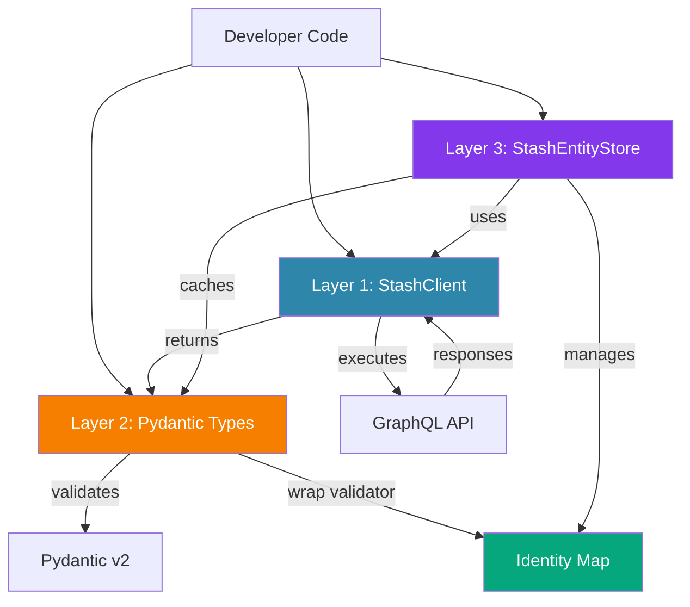

# Architecture Overview

This document provides a detailed technical overview of stash-graphql-client's architecture.

## Three-Layer Architecture Diagram



## Architecture Layers

This library follows a three-layer architecture:

### Layer 1: StashClient (GraphQL Transport)

Located in `stash_graphql_client/client/`, the client provides direct access to Stash's GraphQL API through typed mixin methods.

**Responsibilities**:

- Execute GraphQL queries and mutations
- Handle HTTP/WebSocket transports
- Manage retries and connection pooling
- Deserialize responses to Pydantic models

**Example usage**:

```python
from stash_graphql_client import StashContext

async with StashContext(conn={...}) as client:
    # Direct GraphQL operations
    scenes = await client.find_scenes()
    performer = await client.create_performer(Performer(name="Alice"))
    job_id = await client.metadata_scan()
```

**Mixin architecture**: Client composed of 20+ mixins, one per entity type (SceneClientMixin, PerformerClientMixin, etc.). This provides clear separation of concerns and makes the codebase maintainable.

### Layer 2: Pydantic Types (Schema/ORM Layer)

Located in `stash_graphql_client/types/`, all Stash entities are Pydantic v2 models with:

**Features**:

- **UNSET Pattern** - Three-state fields distinguish "set to value", "set to null", and "never touched"
- **UUID4 Auto-generation** - New objects get temporary IDs replaced with server IDs on save
- **Bidirectional Relationships** - Automatic sync between related entities
- **Tracked Fields** - `__tracked_fields__` and `__field_conversions__` for change detection
- **Relationship Metadata** - `__relationships__` documents query strategies and inverse fields

**Example usage**:

```python
from stash_graphql_client.types import Scene, UNSET

# Create with partial data - UUID4 auto-generated
scene = Scene(title="My Scene", rating100=85)
print(f"New object ID: {scene.id}")  # UUID4 hex string (32 chars)
print(f"Is new: {scene.is_new()}")   # True

# Save sends only non-UNSET fields
await scene.save(client)
print(f"Server ID: {scene.id}")      # Server-assigned ID
print(f"Is new: {scene.is_new()}")   # False

# Update tracks changes
scene.rating100 = 90
changed = scene.get_changed_fields()  # {"rating100": 90}
await scene.save(client)  # Only sends changed fields
```

### Layer 3: StashEntityStore (Identity Map & Caching)

Located in `stash_graphql_client/store.py`, provides SQLAlchemy/ActiveRecord-style data access with:

**Features**:

- **Identity Map** - Same entity ID → same object reference
- **Read-Through Caching** - Fetch from cache or query on miss
- **TTL Support** - Optional cache expiration
- **Field-Aware Population** - Load missing fields on demand
- **Django-Style Filtering** - `field__modifier` kwargs
- **Lazy Iteration** - Paginate large result sets efficiently
- **Thread-Safe** - Uses `RLock` for concurrent access

**Example usage**:

```python
from stash_graphql_client import StashEntityStore
from stash_graphql_client.types import Scene, Performer

store = StashEntityStore(client, ttl_seconds=300)

# Read-through caching
performer = await store.get(Performer, "123")

# Django-style filtering
top_rated = await store.find(Scene, rating100__gte=80)
unrated = await store.find(Scene, rating100__null=True)

# Field-aware population
await store.populate(performer, fields=["scenes", "images"])

# Get-or-create pattern
tag = await store.get_or_create(Tag, name="Action")
```

## When to Use Each Layer

### Use StashClient when:

- ✅ Making one-off queries
- ✅ Need direct control over GraphQL queries
- ✅ Working with entity types that don't need caching
- ✅ Executing mutations that return complex results

### Use Pydantic Types when:

- ✅ Creating new entities with validation
- ✅ Need ORM-like `.save()` / `.delete()` methods
- ✅ Working with entity relationships
- ✅ Need change tracking for partial updates

### Use StashEntityStore when:

- ✅ Need object identity across queries
- ✅ Making repeated queries for same entities
- ✅ Using Django-style filtering
- ✅ Need field-aware population
- ✅ Processing large result sets with pagination

## Related Documentation

- **[Identity Map Architecture](identity-map.md)** - Deep dive on wrap validators and caching
- **[Library Comparisons](comparison.md)** - How this compares to alternatives
- **[Bidirectional Relationships](bidirectional-relationships.md)** - Relationship sync implementation
- **[Overview Guide](../guide/overview.md)** - General overview and design philosophy
