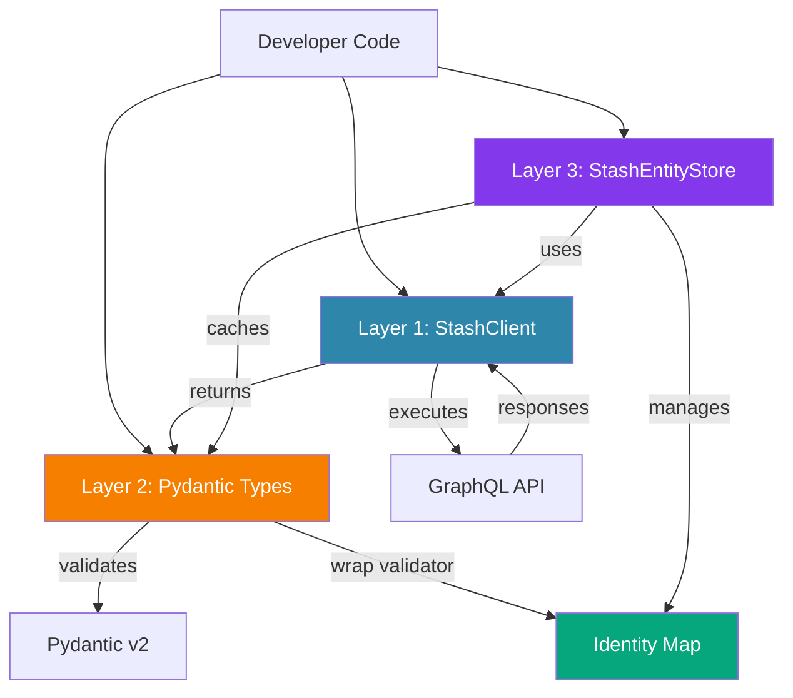
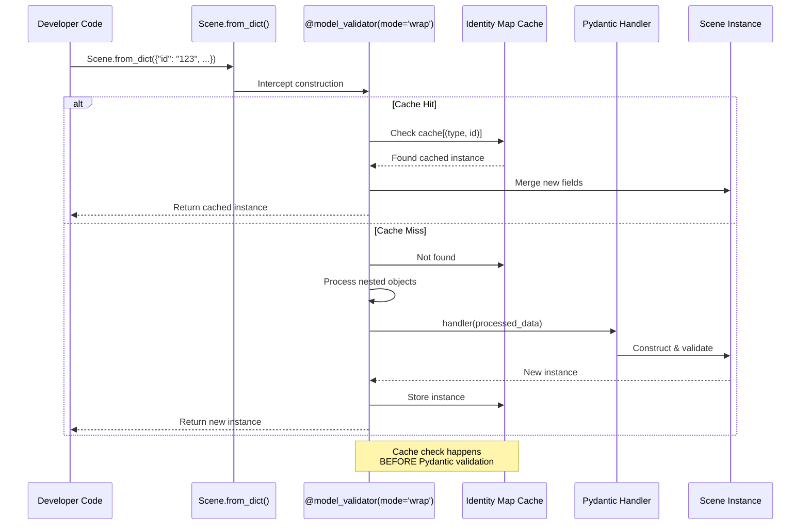
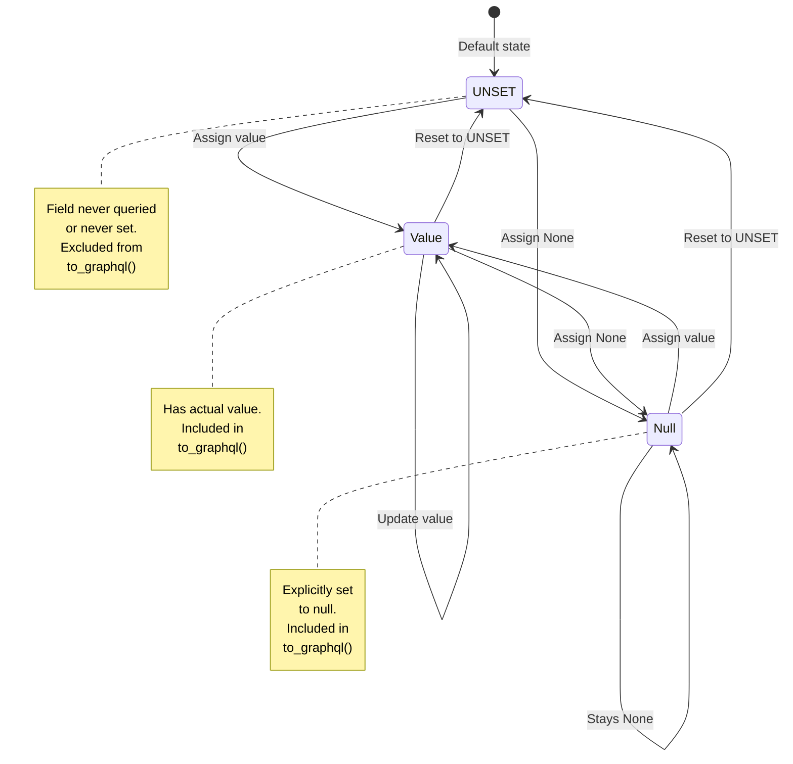
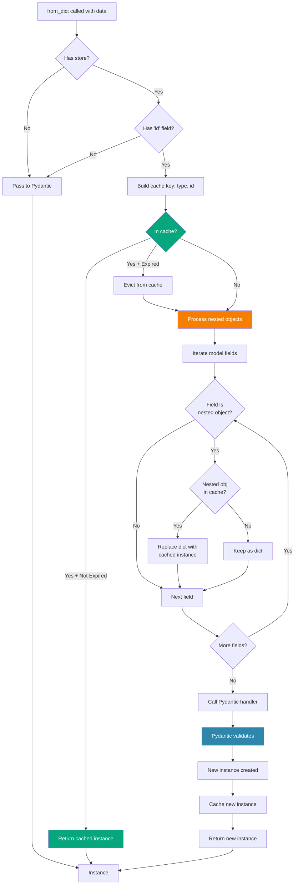
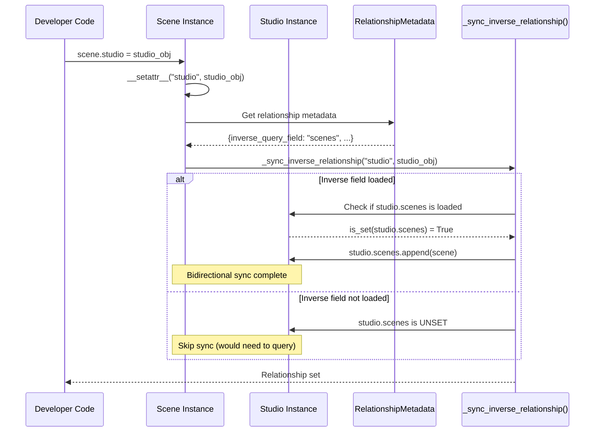
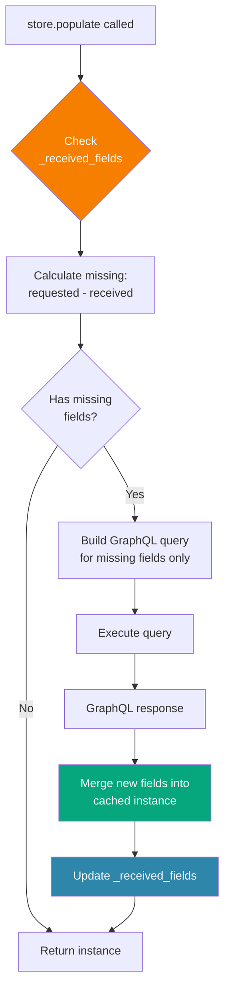
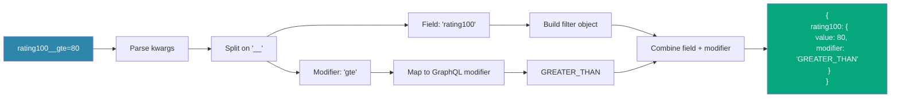

# Architecture Diagrams

This page contains the architecture diagrams for stash-graphql-client.

## Three-Layer Architecture

## Identity Map Flow (Wrap Validator)

## UNSET Pattern - Three States

## Nested Cache Lookup Process

## Relationship Sync Flow

## Field-Aware Population

## Django-Style Filter Translation

